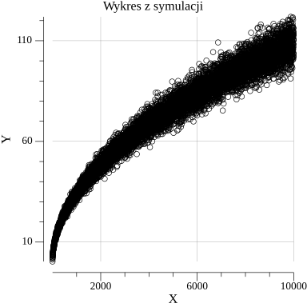

# average-distance-simulation

Ever wondered what the average distance would be if you took __n__ steps moving in eight directions (left, right, up, down, diagonal)? And is there a correlation in general?

I am yes, so decided to analyze this problem.

## First implementation

To do it I choose a programming language Go and firstly write a simple programm in file main.go. It was a simple simulation, you can put from keyboard number (n) and program n times will provide simulation with n steps and count average for each simulation.

Start do it with number = 1000 and results write to file results1000.md

The problem, however, was the time it took to process it. Because the analysis needs results not from a single number.

## Optimalization

So I reminded the threads - one of the advantages of the go language.

And do simulation for more numbers (file run.go), simulation results are automatically saved to the results.txt file

After it needs some analytics. And was written a file function.go

Here on base of mean squared error is choosen the best function amount:
1. √x
2. ln(x)
3. x²
4. x^0.5
5. x^1.5
6. x
7. 1/x
8. sin(x)
9. cos(x)
10. exp(x)
11. log₂(x)
12. log₁₀(x)
13. x/2

Results looks like:
+ Function exp(x) has MSE: +Inf
+ Function log2(x) has MSE: 4255.7919
+ Function log10(x) has MSE: 5372.0287
+ Function sqrt(x) has MSE: 51.2901
+ Function ln(x) has MSE: 4728.6946
+ Function x^1.5 has MSE: 249977698846.7010
+ Function 1/x has MSE: 5895.5879
+ Function sin(x) has MSE: 5896.2385
+ Function x/2 has MSE: 7906656.0026
+ Function x^2 has MSE: 2000493834862243.5000
+ Function x^0.5 has MSE: 51.2901
+ Function x has MSE: 32476583.1246
+ Function cos(x) has MSE: 5896.2151

Based on this result the best fitting function is x^0.5

# Graphics

I would also like to present an image of what this simulation looks like in graphics

